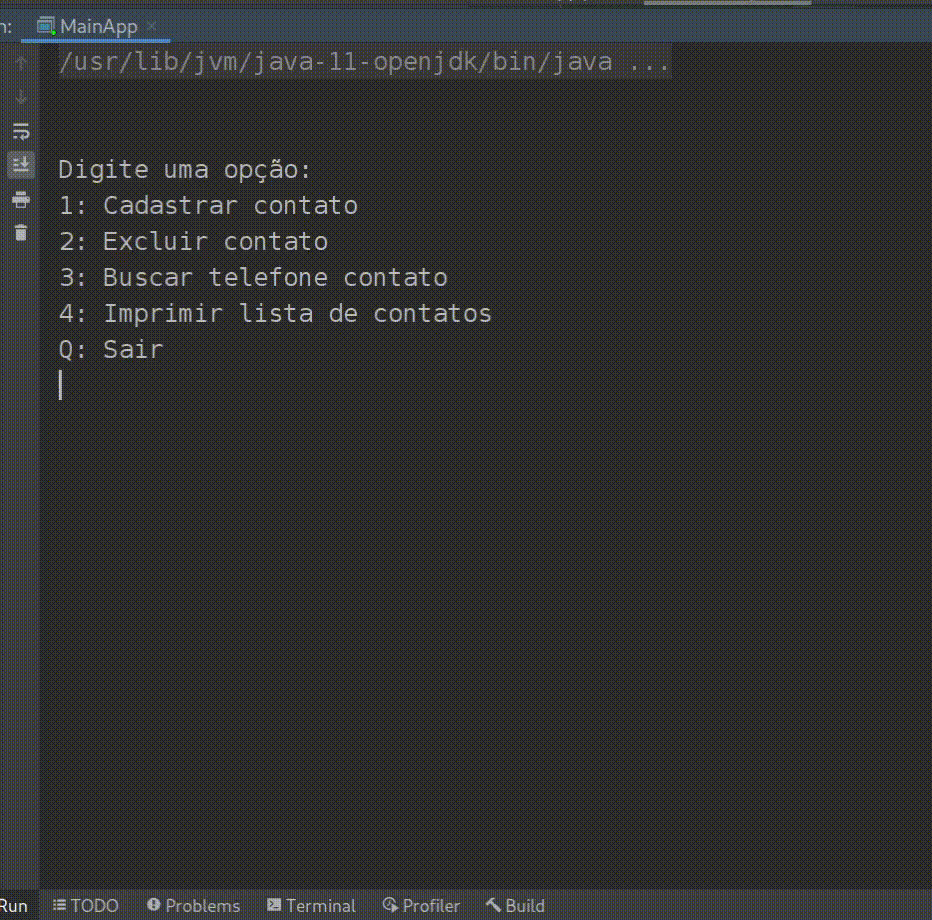

# Sistema de Registro de Contatos

Atividade Somativa em Equipe 1 (ASE1) da disciplina de Resolução de Problemas Estruturados em Computação 
do curso de Engenharia de Software da PUCPR, campus Londrina, com prazo de entrega para o dia 26/04/2021.

**Organização do projeto:**

src/main:
* br.puc.ed.ase1.array: Classe com implementação utilizando array
* br.puc.ed.ase1.lde: Classe com implementação utilizando lista duplamente encadeada
* br.puc.ed.ase1: Classes para implementação do app de registro de contatos

srv/test:
* br.puc.ed.ase1: Classe com testes unitários que devem ser executados para validar o funcionamento 
das implementações de registro de contato em arrays e em lista duplamente encadeada.

**Requisitos:**

1) O aplicativo deve implementar os controles de:
* Cadastro: inclusão de um novo contato com nome e telefone
* Exclusão: exclusão do contato pelo nome
* Busca: busca do contato pelo nome para exibir seu telefone
* Impressão da lista: iteração e impressão de todos os contatos cadastrados

2) O aplicativo deve passar nos testes implementados na classe br.puc.ed.ase1.RegistroDeContatosTest.
   Entregas com falha na execução dos testes unitários pode prejudicar muito a nota.

3) Devem ser implementadas ambas as implementações em array e lista duplamente encadeada. Caso o trabalho
   seja feito individualmente o estudante pode escolher qual tipo de lista implementar.

Exemplo de funcionamento:

**Critérios de Avaliação**

1) Funcionamento correto do aplicativo com array e lista duplamente encadeada.

2) Execução dos testes unitários com sucesso.

3) Inspeção do código-fonte. Adequação a boas práticas de programação e orientação a objetos.
Dica: utilize ferramentas de inspeção de código. Por exemplo Analyze->Inspect Code no IntelliJ IDEA.